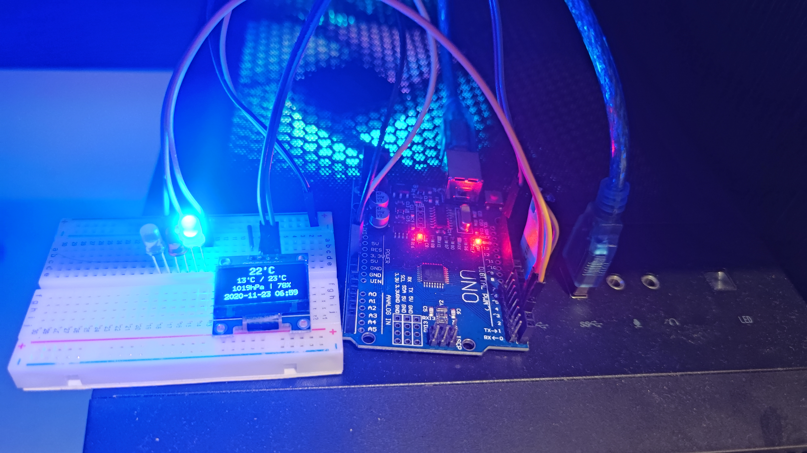

# Ardino-U8G-Weather

### This repo consists of two projects
1. `ArduinoSketch`
2. `HostServerDotNET`

### `ArduinoSketch`
 - It is the sketch file that will be compiled and write into flash of Arudino board
 - Tested board: Arduino Uno (Modified version from Taobao)
 - Workable board: Arduino Uno (Official)
 - Compile tool: `Jetbrains CLion` (Recommanded & tested), `Arduino IDE` or `Visual Studio`
 
### `HostServerDotNET`
 - It is the console program that runs on the host computer device, that will be launched after boot up
 - Compile tool: `Jetbrains Rider` (Recommanded & tested) or `Visual Studio`
 
### Photo

 
 ### Credit
  - U8glib
  - Arduino Team